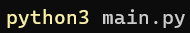
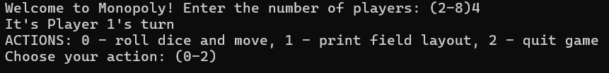
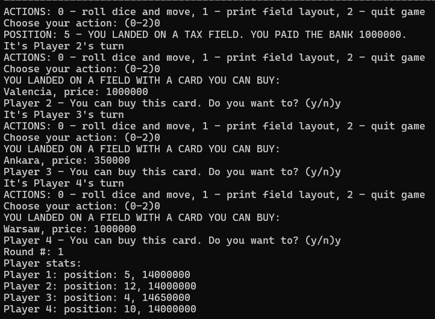
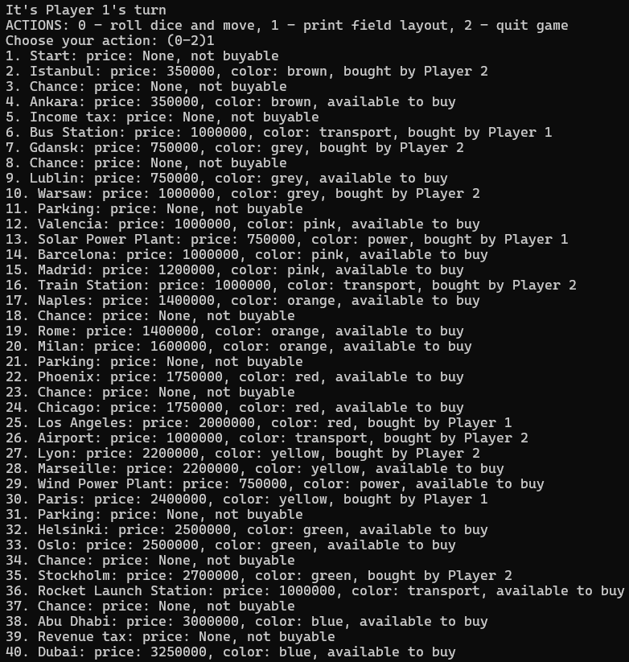
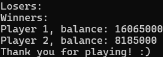

# Monopoly
A simple, text-based implementation of Monopoly using Python. Runs entirely in the terminal, without using any TUI libraries.

A quite primitive implementation considering Python's capabilities, however I wanted to focus on the backend more than the front.
Just needs an interface update from a TUI to a well designed GUI.

# Features:
- Full game logic, including buying properties, paying rent, and chance cards
- Simulated dice rolls and turn-based gameplay
- Simple text-based interface for player actions

## How to run it:

## Starting the game:

## Round playthrough and summary:

## Displaying the game state:

## Closing message:

